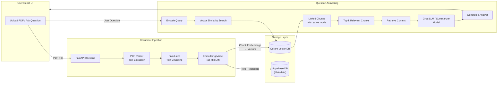
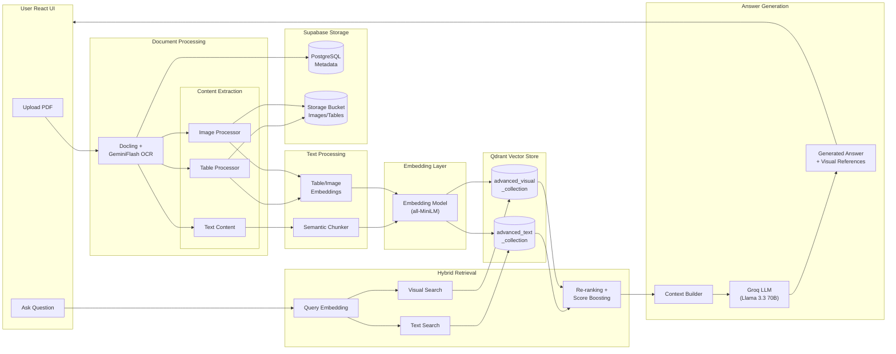

# RAG Pipeline - Dual-Mode Document Processing System

A comprehensive Retrieval-Augmented Generation (RAG) system with two distinct pipelines: **Basic RAG** for simple text extraction and **Advanced RAG** for multimodal document processing with tables and images.

## Table of Contents

- [Features](#features)
- [Prerequisites](#prerequisites)
- [Quick Start](#quick-start)
- [API Usage](#api-usage)
- [Architecture](#architecture)
- [Configuration](#configuration)
- [Testing](#testing)
- [Performance Considerations](#performance-considerations)
- [Troubleshooting](#troubleshooting)
- [Ethical Considerations](#ethical-considerations)
- [Evaluation Guide](#evaluation-guide)
- [License](#license)
- [Contributing](#contributing)
- [Support](#support)

## Features

### Basic RAG Pipeline
- Simple PDF text extraction using PyMuPDF
- Fixed-size chunking with overlap
- Fast embedding generation with sentence-transformers
- Single Qdrant collection for efficient retrieval
- LLM-powered question answering with citations

### Advanced RAG Pipeline
- Multimodal document processing with Docling
- Table detection, extraction, and markdown conversion
- Image extraction with automatic descriptions
- Semantic chunking respecting document structure
- Dual Qdrant collections (text + visual elements)
- Context-aware retrieval with visual element support
- Enhanced LLM responses incorporating tables and images

### LLM Architecture
- **Text Generation**: Groq API with Llama 3.3 70B (fast, cost-effective)
- **Vision Tasks**: Google Gemini 2.0 Flash (image analysis, table understanding)
- **Hybrid Approach**: Best-in-class models for each task type
- **Fallback Support**: Graceful degradation if vision API unavailable

## Prerequisites

- Python 3.9+
- Supabase account (for database)
- Qdrant instance (local or cloud)
- Groq API key (for text generation)
- Google API key (optional, for vision tasks)

## Quick Start

### 1. Clone and Setup

```bash
cd /Users/adwaith/work/projects/RAG
python -m venv RAG
source RAG/bin/activate  # On Windows: RAG\Scripts\activate
pip install -r requirements.txt
```

### 2. Configure Environment

Copy `.env.example` to `.env` and fill in your credentials:

```bash
cp .env.example .env
```

Edit `.env` with your actual values:

```env
# Supabase
SUPABASE_URL=https://your-project.supabase.co
SUPABASE_KEY=your-supabase-anon-key

# Qdrant
QDRANT_URL=http://localhost:6333
QDRANT_API_KEY=  # Optional for local

# LLM API Keys
GROQ_API_KEY=your-groq-api-key
GOOGLE_API_KEY=your-google-api-key  # Optional, for vision tasks

# Settings
DEFAULT_LLM_MODEL=llama-3.3-70b-versatile
```

### 3. Initialize Database

**Supabase Setup:**
1. Go to your Supabase project
2. Navigate to SQL Editor
3. Run the SQL script from `database/schema.sql`

**Qdrant Setup:**

```bash
# If using local Qdrant, start it first:
docker run -p 6333:6333 qdrant/qdrant

# Initialize collections:
python database/init_qdrant.py
```

### 4. Start the Application

```bash
uvicorn app.main:app --reload
```

The API will be available at `http://localhost:8000`

- **API Documentation**: http://localhost:8000/docs
- **Alternative Docs**: http://localhost:8000/redoc

## API Usage

### Basic RAG

#### Upload a PDF

```bash
curl -X POST "http://localhost:8000/api/v1/basic/upload" \
  -H "Content-Type: multipart/form-data" \
  -F "file=@document.pdf"
```

Response:
```json
{
  "document_id": "uuid",
  "filename": "document.pdf",
  "total_pages": 10,
  "chunks_created": 25,
  "ingestion_type": "basic",
  "processing_status": "completed",
  "message": "Document processed successfully"
}
```

#### Query Documents

```bash
curl -X POST "http://localhost:8000/api/v1/basic/query" \
  -H "Content-Type: application/json" \
  -d '{
    "query": "What is the main topic of the document?",
    "top_k": 5
  }'
```

### Advanced RAG

#### Upload a PDF (with tables/images)

```bash
curl -X POST "http://localhost:8000/api/v1/advanced/upload" \
  -H "Content-Type: multipart/form-data" \
  -F "file=@report.pdf"
```

Response:
```json
{
  "document_id": "uuid",
  "filename": "report.pdf",
  "total_pages": 15,
  "chunks_created": 30,
  "visual_elements_count": 8,
  "tables_extracted": 5,
  "images_extracted": 3,
  "ingestion_type": "advanced",
  "processing_status": "completed",
  "message": "Document processed successfully with multimodal extraction"
}
```

#### Query with Multimodal Support

```bash
curl -X POST "http://localhost:8000/api/v1/advanced/query" \
  -H "Content-Type: application/json" \
  -d '{
    "query": "What does the revenue table show?",
    "top_k": 10
  }'
```

## Architecture

### Basic RAG System



### Advanced RAG System



### Project Structure

```
RAG/
├── app/
│   ├── api/
│   │   ├── v1/
│   │   │   ├── basic_rag.py       # Basic RAG endpoints
│   │   │   └── advanced_rag.py    # Advanced RAG endpoints
│   │   └── dependencies.py
│   ├── core/
│   │   ├── config.py              # Configuration
│   │   └── database.py            # Supabase client
│   ├── models/
│   │   ├── schemas.py             # Pydantic models
│   │   └── database_models.py     # DB models
│   ├── services/
│   │   ├── embeddings/
│   │   │   └── embedding_service.py
│   │   ├── pdf/
│   │   │   ├── basic_processor.py
│   │   │   └── advanced_processor.py
│   │   ├── vector_store/
│   │   │   ├── qdrant_basic.py
│   │   │   └── qdrant_advanced.py
│   │   ├── visual/
│   │   │   ├── table_processor.py
│   │   │   └── image_processor.py
│   │   └── llm/
│   │       └── llm_service.py
│   ├── utils/
│   │   ├── chunking.py
│   │   ├── file_storage.py
│   │   └── validators.py
│   └── main.py
├── database/
│   ├── schema.sql
│   └── init_qdrant.py
├── storage/                        # Local file storage
├── requirements.txt
├── .env.example
└── README.md
```

### Data Flow

#### Basic RAG Pipeline
1. PDF Upload → PyMuPDF extraction
2. Fixed-size chunking (1000 chars, 200 overlap)
3. Embedding generation (sentence-transformers)
4. Storage in `basic_rag_collection`
5. Query → Embed → Search → LLM generation

#### Advanced RAG Pipeline
1. PDF Upload → Docling extraction (text + tables + images)
2. Table processing → Markdown + descriptions
3. Image processing → File storage + descriptions
4. Semantic chunking with structure awareness
5. Dual embeddings (text + visual)
6. Storage in `advanced_text_collection` + `advanced_visual_collection`
7. Query → Embed → Hybrid search → Multimodal LLM generation

### Database Schema

**Collections:**
- `basic_rag_collection` - Basic text chunks
- `advanced_text_collection` - Advanced text chunks with visual refs
- `advanced_visual_collection` - Tables and images

**Supabase Tables:**
- `documents` - Document metadata
- `chunks` - Text chunks
- `visual_elements` - Tables and images (advanced only)
- `embeddings` - Vector references
- `query_logs` - Query analytics

## Configuration

### Environment Variables

| Variable | Description | Default |
|----------|-------------|---------|
| `SUPABASE_URL` | Supabase project URL | Required |
| `SUPABASE_KEY` | Supabase anon key | Required |
| `QDRANT_URL` | Qdrant instance URL | `http://localhost:6333` |
| `QDRANT_API_KEY` | Qdrant API key | Optional |
| `GROQ_API_KEY` | Groq API key for text LLM | Required |
| `GOOGLE_API_KEY` | Google API key for vision | Optional |
| `DEFAULT_LLM_MODEL` | Groq model name | `llama-3.3-70b-versatile` |
| `EMBEDDING_MODEL` | Embedding model | `sentence-transformers/all-MiniLM-L6-v2` |
| `BASIC_TOP_K` | Basic retrieval count | `5` |
| `ADVANCED_TOP_K` | Advanced retrieval count | `10` |

### Available Groq Models

You can change the `DEFAULT_LLM_MODEL` to any of these Groq models:

| Model | Description | Best For |
|-------|-------------|----------|
| `llama-3.3-70b-versatile` | Latest Llama 3.3 70B (default) | Best overall quality |
| `llama-3.1-70b-versatile` | Llama 3.1 70B | Fast, high quality |
| `llama-3.1-8b-instant` | Llama 3.1 8B | Ultra-fast responses |
| `mixtral-8x7b-32768` | Mixtral 8x7B | Large context (32k tokens) |
| `gemma2-9b-it` | Google Gemma 2 9B | Efficient, good quality |

## Testing

### Test Basic RAG

```python
import requests

# Upload
with open("test.pdf", "rb") as f:
    response = requests.post(
        "http://localhost:8000/api/v1/basic/upload",
        files={"file": f}
    )
print(response.json())

# Query
response = requests.post(
    "http://localhost:8000/api/v1/basic/query",
    json={"query": "What is this document about?"}
)
print(response.json())
```

### Test Advanced RAG

```python
# Upload with multimodal processing
with open("report.pdf", "rb") as f:
    response = requests.post(
        "http://localhost:8000/api/v1/advanced/upload",
        files={"file": f}
    )
print(response.json())

# Query with visual elements
response = requests.post(
    "http://localhost:8000/api/v1/advanced/query",
    json={"query": "Summarize the data in the tables"}
)
print(response.json())
```

## Performance Considerations

- **Batch Processing**: Embeddings are generated in batches for efficiency
- **Singleton Pattern**: Embedding model loaded once and reused
- **Collection Separation**: Clean isolation between basic and advanced pipelines
- **Async Operations**: FastAPI async endpoints for better concurrency

## Troubleshooting

### Docling Installation Issues

If Docling fails to install:
```bash
# Install system dependencies (macOS)
brew install poppler tesseract

# Or use basic RAG only
# The system will fallback to PyMuPDF if Docling is unavailable
```

### Qdrant Connection Issues

```bash
# Check if Qdrant is running
curl http://localhost:6333/collections

# Restart Qdrant
docker restart <qdrant-container>
```

### Supabase Connection Issues

- Verify your `SUPABASE_URL` and `SUPABASE_KEY`
- Check if tables are created (run `database/schema.sql`)
- Ensure RLS policies allow operations

### Advanced Pipeline Text Extraction

The advanced pipeline uses Docling's `export_to_text()` method to ensure clean text extraction without XML-like structure markers. If you see unusual formatting in chunks, verify that Docling is properly installed.

## Ethical Considerations

This section addresses ethical implications, limitations, and responsible use of the RAG Pipeline system.

### Data Privacy and Security

#### Concerns
- **Document Content**: Uploaded documents are stored and indexed, potentially containing sensitive information
- **Query Logging**: Queries are logged to `query_logs` table for analytics
- **Vector Embeddings**: Document embeddings may encode sensitive patterns
- **API Transmission**: LLM requests are sent to third-party APIs (Groq, Google)

#### Mitigations
- Documents are processed locally (embeddings generated on-device)
- No document content is sent to external services except:
  - Groq API (receives retrieved chunks for answer generation)
  - Google Gemini API (optional, for image descriptions)
- Consider deploying with data retention policies
- For sensitive use cases, consider self-hosted LLM solutions

### Bias and Fairness

#### Potential Sources of Bias
1. **Embedding Model Bias**: `all-MiniLM-L6-v2` may have biases from training data
2. **LLM Bias**: Groq/Gemini models may generate biased responses
3. **Retrieval Bias**: Popular/common topics may be over-retrieved
4. **Document Bias**: System reflects biases in uploaded documents
5. **Language Bias**: System is optimized for English; other languages may underperform

#### Recommendations
- Audit document collections for representation
- Review generated answers for biased language
- Consider diverse evaluation datasets
- Monitor retrieval patterns for systematic biases

### Hallucination and Misinformation Risks

#### The Problem
- LLMs may generate plausible-sounding but incorrect information
- Even with RAG, models can ignore or misinterpret context
- Users may trust AI-generated answers without verification
- The system cannot detect if source documents contain misinformation

#### Mitigations in This System
- **Faithfulness metric** measures grounding in context (scores < 0.5 indicate risk)
- Answers include source citations (`[Source N]` notation)
- Context is provided alongside answers for verification

#### User Recommendations
- Always verify critical information from original sources
- Use the citation feature to trace claims
- Be skeptical of confident-sounding but unverified claims
- Never rely solely on RAG answers for medical, legal, or financial decisions

### Transparency

#### What Users Should Know
- This system uses AI models (Groq, Gemini) for text generation
- Answers are generated, not retrieved verbatim from documents
- Performance varies based on document quality and query type
- The system may make mistakes; human oversight is recommended

#### Model Cards
| Component | Model | Purpose |
|-----------|-------|---------|
| Text Generation | Groq Llama 3.3 70B | Answer generation |
| Vision | Google Gemini 2.0 Flash | Image/table descriptions |
| Embeddings | sentence-transformers/all-MiniLM-L6-v2 | Semantic search |

### Copyright and Licensing

- Uploaded documents may be copyrighted
- Generated answers may reproduce copyrighted text
- Consider fair use implications for your jurisdiction
- Ensure you have rights to process uploaded documents
- Don't use system output as substitute for licensed content

### Technical Limitations
- Cannot process password-protected PDFs
- Context window limits may miss relevant information
- Chunking may split important information across chunks
- OCR errors in scanned PDFs affect text extraction
- Table/image extraction quality depends on PDF structure
- Rate limits on free API tiers restrict throughput
- No real-time knowledge beyond uploaded documents

### Responsible Deployment Checklist
- [ ] Implement access controls (who can upload/query)
- [ ] Add usage monitoring and rate limiting
- [ ] Create data retention and deletion policies
- [ ] Provide clear user documentation about capabilities and limits
- [ ] Establish feedback mechanism for reporting issues
- [ ] Regular audits of system behavior and outputs

---

## Evaluation Guide

This section describes how to run evaluations and interpret results.

### Quick Start

```bash
# Run full evaluation (No-RAG vs Basic RAG vs Advanced RAG)
python evaluation/run_evaluation.py

# Dry run (3 questions only, for testing)
python evaluation/run_evaluation.py --dry-run

# Evaluate only specific methods
python evaluation/run_evaluation.py --methods basic_rag
python evaluation/run_evaluation.py --methods no_rag basic_rag advanced_rag
```

### Prerequisites

1. **API Server Running** (for Basic/Advanced RAG):
   ```bash
   uvicorn app.main:app --reload
   ```

2. **Environment Variables**: Ensure `.env` is configured with `GROQ_API_KEY`

3. **Documents Uploaded**: For Basic/Advanced RAG, upload test documents first

### Evaluation Metrics

#### Generation Metrics (Primary)

| Metric | What it Measures | Range | Priority |
|--------|------------------|-------|----------|
| **Faithfulness** | Is answer grounded in retrieved context? | 0-1 | Critical |
| **Answer Relevancy** | Does answer address the question? | 0-1 | Critical |
| **Keyword Overlap** | % of expected keywords in answer | 0-1 | Medium |
| **Accuracy** | Token overlap with expected (Jaccard) | 0-1 | Secondary |

#### Retrieval Metrics

| Metric | What it Measures | Range |
|--------|------------------|-------|
| **Precision@K** | % of retrieved chunks that are relevant | 0-1 |
| **Recall@K** | % of relevant chunks that were retrieved | 0-1 |
| **MRR** | Position of first relevant chunk | 0-1 |
| **Hit Rate** | Was any relevant chunk retrieved? | 0 or 1 |

### Error Analysis

Run error analysis on evaluation results:

```bash
# Analyze most recent evaluation
python evaluation/error_analysis.py

# Analyze specific results file
python evaluation/error_analysis.py --results evaluation/results/evaluation_XXXXXX.json

# Save report to specific location
python evaluation/error_analysis.py --output my_analysis.md
```

The error analyzer categorizes failures:
- **API Errors**: System/network issues
- **Low Faithfulness**: Potential hallucinations (answer not grounded in context)
- **Low Relevancy**: Answer doesn't address the question
- **Low Keyword Match**: Missing expected key terms
- **Verbose Correct**: Answer is correct but penalized by Jaccard similarity

### Test Dataset

Located at `evaluation/datasets/test_queries.json`:
- 10 curated questions about NLP research papers
- Ground truth answers with expected keywords
- Difficulty levels: easy, medium, hard
- Papers covered: Word2Vec, DistilBERT, ELMo, RoBERTa, REALM

### Evaluation Output

Results are saved to `evaluation/results/`:
- `evaluation_YYYYMMDD_HHMMSS.json` - Full results with per-question data
- `summary_YYYYMMDD_HHMMSS.json` - Aggregated metrics only
- `error_analysis_YYYYMMDD_HHMMSS.md` - Error analysis report

### Interpreting Results

#### Expected Performance Pattern
- **No-RAG**: Lower scores on domain-specific questions (no document context)
- **Basic RAG**: Improved over No-RAG with document context
- **Advanced RAG**: Best on questions about tables/images

#### Key Indicators
1. **RAG vs No-RAG Gap**: Larger gap = more value from retrieval
2. **Faithfulness**: Should be higher for RAG methods (grounded in context)
3. **Latency**: No-RAG fastest, Advanced RAG slowest

### Adding Custom Test Questions

Edit `evaluation/datasets/test_queries.json`:

```json
{
  "id": "custom_1",
  "question": "Your question here?",
  "expected_answer": "Expected answer text",
  "keywords": ["key", "terms"],
  "difficulty": "medium",
  "category": "custom"
}
```

## License

MIT License

## Contributing

Contributions welcome! Please feel free to submit a Pull Request.

## Support

For issues and questions, please open an issue on GitHub.
